# 1. Módulo de Red: DHCP y DNS

Bienvenido a la documentación técnica del módulo de red de nuestra
infraestructura. Este apartado describe el despliegue, la configuración y la
validación de los dos servicios que hacen posible la conectividad interna
automática de la empresa: el **servidor DHCP** y el **servidor DNS**.

Ambos servicios se ejecutan sobre una misma máquina Ubuntu Server 24.04 LTS
que actúa como nodo central de la red `RedEmpresa`.

## 1.1. Resumen del Módulo

El objetivo de este módulo es garantizar que cualquier dispositivo conectado
a la red corporativa obtenga una configuración de red operativa sin
intervención manual, y que pueda acceder a los servicios internos
(`www.empresa.local`, `nas.empresa.local`, `intranet.empresa.local`)
utilizando nombres de dominio en lugar de direcciones IP.

### 1.1.1. Servicios desplegados en este módulo

* **Servidor DHCP** (ISC DHCP Server): asignación dinámica de direcciones IP
  y entrega automática de parámetros de red (gateway, DNS, dominio).
* **Servidor DNS** (BIND9): resolución directa e inversa del dominio
  privado `empresa.local`.
* **Integración DHCP ↔ DNS**: configuración cruzada para que los clientes
  reciban por DHCP la dirección del DNS interno.

## 1.2. Datos Técnicos de Referencia

| Parámetro                  | Valor                             |
|----------------------------|-----------------------------------|
| Sistema operativo          | Ubuntu Server 24.04.3 LTS         |
| Dominio interno            | `empresa.local`                   |
| Red interna                | `192.168.10.0/24`                 |
| IP del servidor DHCP + DNS | `192.168.10.2`                    |
| LAN Segment (VMware)       | `RedEmpresa`                      |
| Rango dinámico DHCP        | `192.168.10.100 – 192.168.10.200` |
| Usuario administrador      | `admin-red` (Alberto Belda)       |

## 1.3. Arquitectura de la Red

La red interna está segmentada en tres tramos funcionales, respetando el
principio de separación entre infraestructura, servicios y clientes:

| Rango                   | Uso                                         |
|-------------------------|---------------------------------------------|
| `192.168.10.1`          | Gateway / Router de salida                  |
| `192.168.10.2`          | Servidor DHCP + DNS (este módulo)           |
| `192.168.10.10`         | Servidor Web (Samuel Puma)                  |
| `192.168.10.20`         | Servidor NAS (Jacob Vila)                   |
| `192.168.10.100 – .200` | Rango dinámico asignado por DHCP a clientes |
| `192.168.10.201 – .254` | Reservado para futuras ampliaciones         |

### 1.3.1. Interfaces de red del servidor

La máquina dispone de dos tarjetas de red independientes:

* **`ens33`** (modo NAT): acceso a Internet para la descarga de paquetes y
  actualizaciones del sistema.
* **`ens37`** (LAN Segment `RedEmpresa`): red interna donde se ofrecen los
  servicios DHCP y DNS.

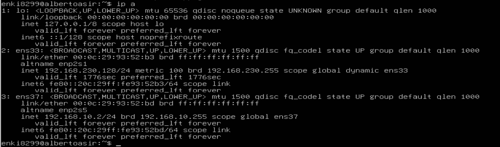

### 1.3.2. Configuración de IP fija con Netplan

Archivo `/etc/netplan/50-cloud-init.yaml`:

```yaml
network:
  version: 2
  ethernets:
    ens33:
      dhcp4: true
    ens37:
      dhcp4: false
      addresses:
        - 192.168.10.2/24
```

Aplicación de los cambios:

```bash
sudo netplan apply
```

## 1.4. Despliegue del Servidor DHCP

### 1.4.1. Instalación

```bash
sudo apt update
sudo apt install isc-dhcp-server -y
```

### 1.4.2. Selección de la interfaz de escucha

En `/etc/default/isc-dhcp-server` se limita el servicio a la red interna
para evitar cualquier impacto sobre la red externa:

```bash
INTERFACESv4="ens37"
```

### 1.4.3. Configuración principal del DHCP

Archivo `/etc/dhcp/dhcpd.conf`:

```conf
# --- Configuración empresa.local (admin-red) ---
authoritative;
default-lease-time 600;
max-lease-time 7200;
option domain-name "empresa.local";
option domain-name-servers 192.168.10.2;

subnet 192.168.10.0 netmask 255.255.255.0 {
    range 192.168.10.100 192.168.10.200;
    option routers 192.168.10.1;
    option broadcast-address 192.168.10.255;
}
```

Elementos destacados de la configuración:

* **`authoritative`**: declara este servidor como el DHCP oficial del segmento.
* **`default-lease-time 600`**: los clientes renuevan su concesión cada 10 minutos.
* **`option domain-name-servers 192.168.10.2`**: entrega como DNS al propio
  servidor BIND9 local, habilitando la integración DHCP ↔ DNS.

### 1.4.4. Arranque y verificación del servicio

```bash
sudo systemctl restart isc-dhcp-server
sudo systemctl status isc-dhcp-server
```

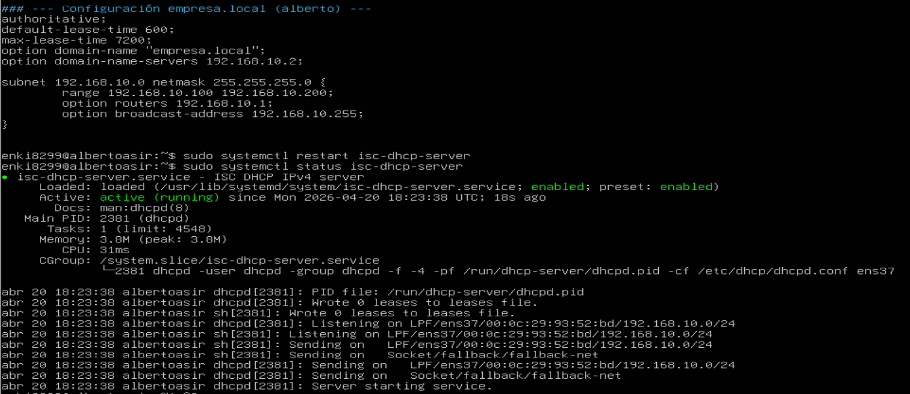

El servicio queda en estado `active (running)` y escuchando sobre la
interfaz correcta.

## 1.5. Validación del DHCP con cliente real

Para demostrar el funcionamiento end-to-end se ha desplegado una segunda
máquina virtual (Lubuntu) conectada al mismo LAN Segment `RedEmpresa`,
sin ninguna configuración IP manual.

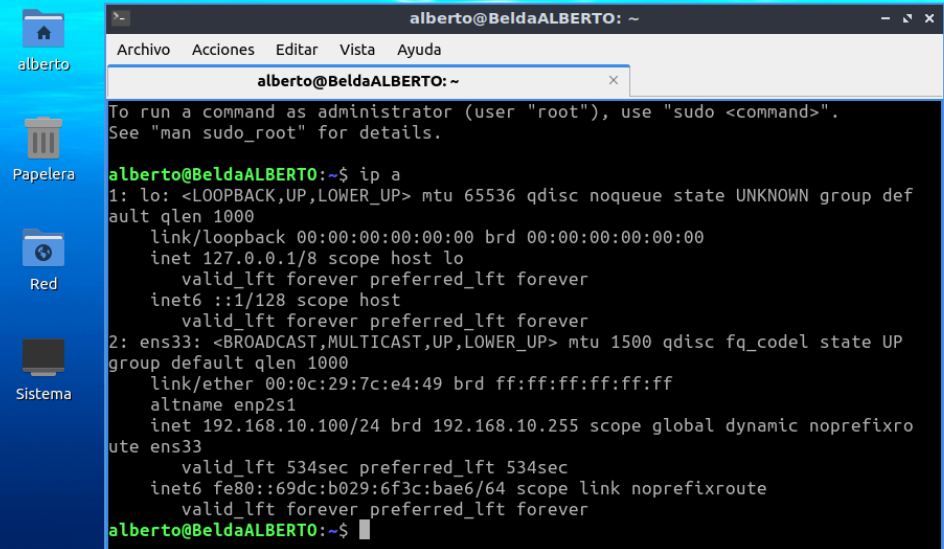

El cliente obtuvo automáticamente la IP `192.168.10.100` (la primera
disponible del rango configurado), confirmando el correcto funcionamiento
del servicio.

### 1.5.1. Trazabilidad mediante leases

El servidor mantiene un registro detallado de todas las concesiones
emitidas en el archivo `/var/lib/dhcp/dhcpd.leases`:

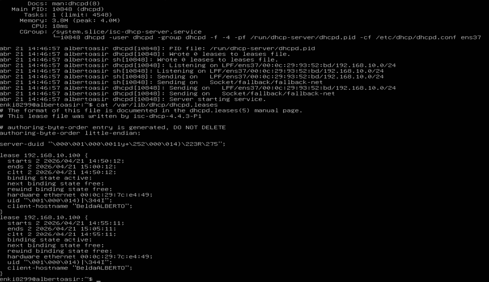

Se verifica la coincidencia exacta entre:

* La dirección MAC del cliente (`00:0c:29:7c:e4:49`) en el `ip a` del
  cliente y en el archivo de leases del servidor.
* El hostname del cliente (`BeldaALBERTO`).
* El tiempo de concesión: 10 minutos, conforme al parámetro
  `default-lease-time` configurado.

Esta trazabilidad es fundamental para auditoría y resolución de incidencias
en entornos reales.

## 1.6. Despliegue del Servidor DNS (BIND9)

### 1.6.1. Instalación

```bash
sudo apt install bind9 bind9utils bind9-doc dnsutils -y
```

| Paquete       | Finalidad                                                |
|---------------|----------------------------------------------------------|
| `bind9`       | Servidor DNS propiamente dicho                           |
| `bind9utils`  | Utilidades `named-checkconf` y `named-checkzone`         |
| `bind9-doc`   | Documentación local                                       |
| `dnsutils`    | Herramientas de diagnóstico `dig` y `nslookup`           |

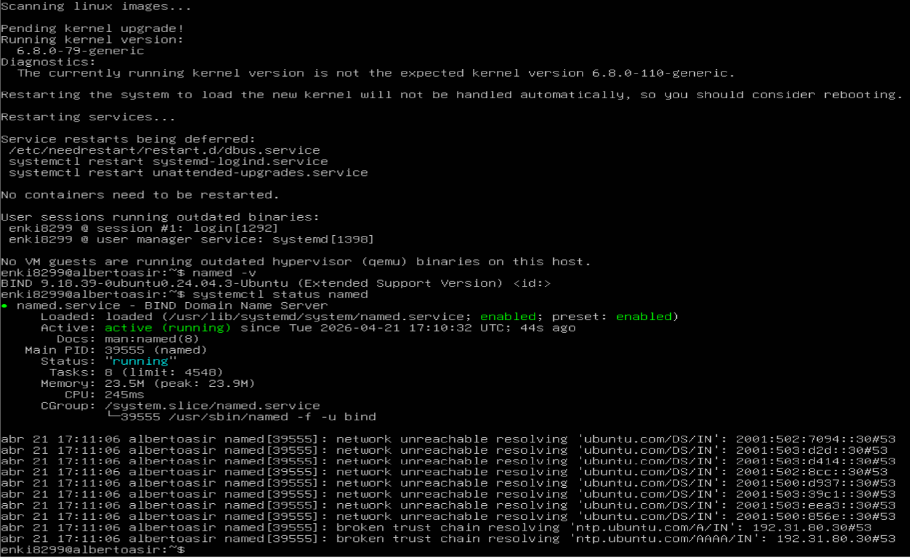

Versión desplegada: **BIND 9.18.39** (incluida en Ubuntu 24.04 LTS).

### 1.6.2. Conceptos de registros DNS

| Registro | Función                                                        |
|----------|----------------------------------------------------------------|
| `SOA`    | "Start of Authority" — abre la zona y fija sus parámetros       |
| `NS`     | Designa el servidor autoritativo de la zona                     |
| `A`      | Asocia un nombre a una dirección IPv4                           |
| `CNAME`  | Alias de otro nombre de dominio                                 |
| `PTR`    | Resolución inversa: IP → nombre (usado en la zona inversa)     |

### 1.6.3. Declaración de zonas

Archivo `/etc/bind/named.conf.local`:

```conf
// Zona directa del dominio empresa.local
zone "empresa.local" {
    type master;
    file "/etc/bind/db.empresa.local";
};

// Zona inversa para la red 192.168.10.0/24
zone "10.168.192.in-addr.arpa" {
    type master;
    file "/etc/bind/db.192.168.10";
};
```

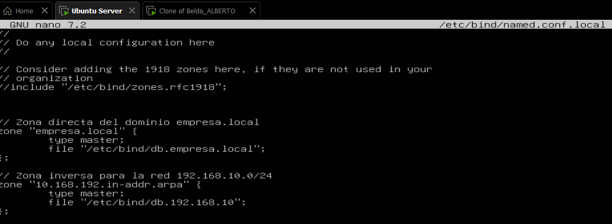

💡 **Nota técnica:** en la zona inversa los tres primeros octetos de la red
se escriben invertidos (`10.168.192.in-addr.arpa` ↔ `192.168.10.0`).

### 1.6.4. Zona directa — `/etc/bind/db.empresa.local`

```
$TTL    604800
@   IN  SOA ns1.empresa.local. admin.empresa.local. (
              2026042101 ; Serial (formato YYYYMMDDNN)
              604800     ; Refresh
              86400      ; Retry
              2419200    ; Expire
              604800 )   ; Negative Cache TTL
;
@        IN  NS    ns1.empresa.local.
ns1      IN  A     192.168.10.2
www      IN  A     192.168.10.10
nas      IN  A     192.168.10.20
intranet IN  CNAME www.empresa.local.
```

Validación de sintaxis:

```bash
sudo named-checkzone empresa.local /etc/bind/db.empresa.local
```

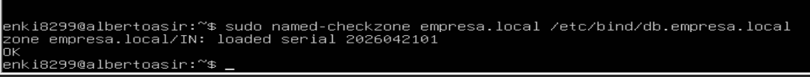

### 1.6.5. Zona inversa — `/etc/bind/db.192.168.10`

```
$TTL    604800
@   IN  SOA ns1.empresa.local. admin.empresa.local. (
              2026042101 ; Serial
              604800     ; Refresh
              86400      ; Retry
              2419200    ; Expire
              604800 )   ; Negative Cache TTL
;
@   IN  NS    ns1.empresa.local.
2   IN  PTR   ns1.empresa.local.
10  IN  PTR   www.empresa.local.
20  IN  PTR   nas.empresa.local.
```

Los números `2`, `10` y `20` corresponden al último octeto de cada IP
de la red.

Validación:

```bash
sudo named-checkzone 10.168.192.in-addr.arpa /etc/bind/db.192.168.10
```

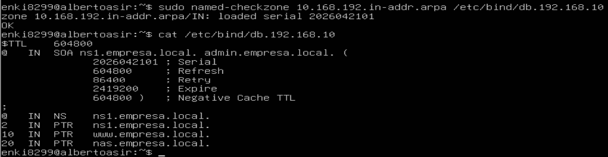

### 1.6.6. Arranque del servicio DNS

```bash
sudo systemctl restart named
sudo systemctl status named
```

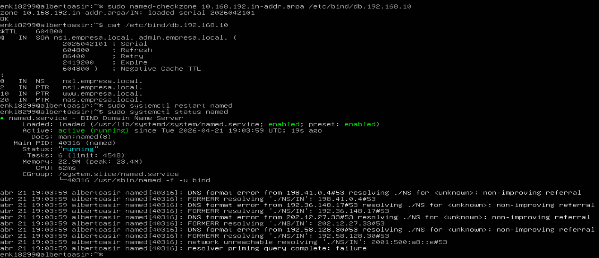

## 1.7. Matriz de Registros DNS Configurados

| Nombre                   | Tipo  | Destino              | Servicio asociado     |
|--------------------------|-------|----------------------|-----------------------|
| `ns1.empresa.local`      | A     | `192.168.10.2`       | Servidor DNS          |
| `www.empresa.local`      | A     | `192.168.10.10`      | Servidor Web (Samuel) |
| `nas.empresa.local`      | A     | `192.168.10.20`      | Servidor NAS (Jacob)  |
| `intranet.empresa.local` | CNAME | → `www.empresa.local`| Alias del portal web  |
| `192.168.10.2`           | PTR   | `ns1.empresa.local`  | Resolución inversa    |
| `192.168.10.10`          | PTR   | `www.empresa.local`  | Resolución inversa    |
| `192.168.10.20`          | PTR   | `nas.empresa.local`  | Resolución inversa    |

## 1.8. Pruebas de Funcionamiento End-to-End

### 1.8.1. Resolución directa (nombre → IP)

```bash
dig @192.168.10.2 www.empresa.local
```

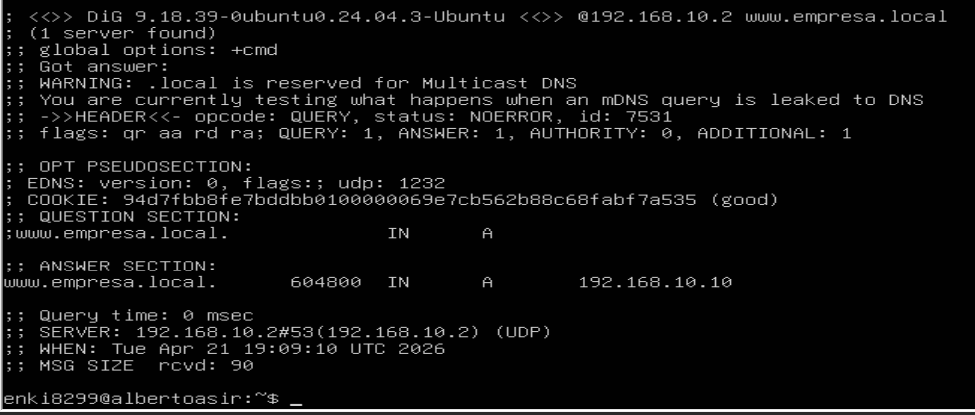

En la sección `ANSWER SECTION` se obtiene:

```
www.empresa.local.  604800  IN  A  192.168.10.10
```

Indicadores de éxito:

* **`status: NOERROR`**: consulta procesada sin errores.
* **Flag `aa`** (authoritative answer): el servidor responde como
  autoritativo de la zona.
* **`SERVER: 192.168.10.2#53`**: la respuesta procede del servidor
  configurado.

### 1.8.2. Resolución inversa (IP → nombre)

```bash
dig @192.168.10.2 -x 192.168.10.10
```

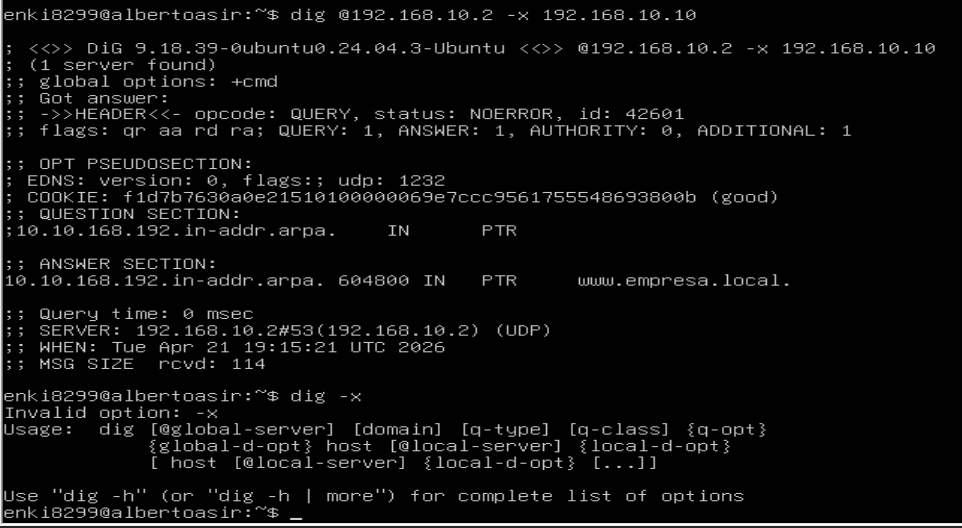

Respuesta:

```
10.10.168.192.in-addr.arpa.  604800  IN  PTR  www.empresa.local.
```

Esto confirma el funcionamiento bidireccional del DNS, necesario para
análisis de logs, diagnóstico de red y auditoría de seguridad.

## 1.9. Integración DHCP ↔ DNS

El valor diferencial de esta arquitectura reside en la integración
entre ambos servicios, que se produce en cuatro pasos transparentes
para el usuario final:

1. Un dispositivo se conecta a la red `RedEmpresa`.
2. El **servidor DHCP** le asigna automáticamente una IP del rango
   dinámico `192.168.10.100 – 192.168.10.200`.
3. Dentro del mismo lease, el DHCP le entrega como servidor DNS la IP
   `192.168.10.2` (el propio BIND9).
4. Al consultar `www.empresa.local`, el cliente recibe `192.168.10.10`
   y accede directamente al servidor web.

> 💡 **Consecuencia práctica:** conectarse a la red equivale a disponer
> de acceso completo a los servicios internos **por nombre**, sin
> intervención manual.

## 1.10. Perfil de Administración y Permisos

La administración de estos servicios está restringida al usuario
`admin-red`, siguiendo el principio de mínimo privilegio.

**Permisos asignados:**

* Reinicio controlado de `isc-dhcp-server` y `bind9`.
* Edición de `/etc/dhcp/dhcpd.conf`, `/etc/bind/*` y `/etc/netplan/*`.

**Restricciones explícitas:**

* Sin acceso a Apache (Samuel), NAS (Jacob) ni políticas de firewall (Blai).
* Sin permisos para la creación o gestión de usuarios del sistema.

Consultar el apartado **Gestión de Usuarios** del portal para la matriz
completa de permisos del proyecto.

## 1.11. Resumen Ejecutivo del Módulo

| Entregable                                            | Estado |
|-------------------------------------------------------|--------|
| Servidor con IP fija `192.168.10.2`                   | ✅     |
| DHCP repartiendo IPs del rango `.100 – .200`          | ✅     |
| Cliente real (Lubuntu) obteniendo IP automáticamente  | ✅     |
| Registro de leases operativo                          | ✅     |
| BIND9 instalado y en ejecución                        | ✅     |
| Zona directa `empresa.local` validada (`OK`)          | ✅     |
| Zona inversa `10.168.192.in-addr.arpa` validada (`OK`)| ✅     |
| Resolución directa (nombre → IP) funcional            | ✅     |
| Resolución inversa (IP → nombre) funcional            | ✅     |
| Integración DHCP ↔ DNS operativa                      | ✅     |

## 1.12. Referencias Técnicas

* Documentación oficial BIND9 — <https://bind9.readthedocs.io/>
* Guía de zonas inversas (APNIC) —
  <https://www.apnic.net/about-apnic/corporate-documents/documents/resource-guidelines/reverse-zones/>
* Configuración BIND9 en Ubuntu 24.04 —
  <https://kifarunix.com/how-to-setup-bind-dns-server-on-ubuntu-24-04/>
* Netplan — configuración de red en Ubuntu —
  <https://netplan.io/reference>
* ISC DHCP Server — <https://www.isc.org/dhcp/>

---

*Última actualización: Abril 2026 · Módulo mantenido por el Administrador de Red (admin-red).*
